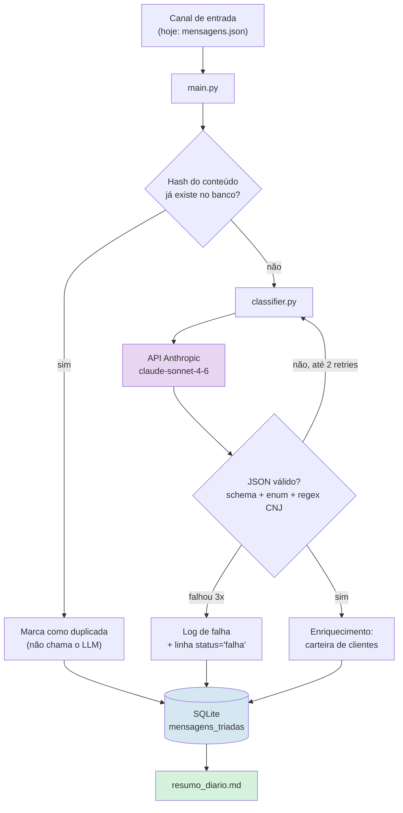

# Triagem inteligente de mensagens — BKM Advogados

Pipeline em Python que lê mensagens brutas de clientes (WhatsApp/e-mail), usa um LLM
para classificar e extrair dados estruturados, grava tudo em SQLite e gera um resumo
diário em Markdown com os prazos no topo.

Teste técnico — Vaga A (Analista de Automação e IA).

---

## Sumário

- [Como rodar](#como-rodar)
- [Arquitetura](#arquitetura)
- [Como o LLM é usado](#como-o-llm-é-usado)
- [O que fica no banco](#o-que-fica-no-banco)
- [Decisões e premissas](#decisões-e-premissas)
- [Por que Python puro e não n8n](#por-que-python-puro-e-não-n8n)
- [Extras implementados](#extras-implementados)
- [O que eu faria com mais tempo](#o-que-eu-faria-com-mais-tempo)
- [Estimativa de custo mensal](#estimativa-de-custo-mensal)

---

## Como rodar

Requisitos: Python 3.10+.

```bash
# 1. Ambiente
python -m venv .venv && source .venv/bin/activate     # Windows: .venv\Scripts\activate
pip install -r requirements.txt

# 2. Credencial (o .env está no .gitignore e nunca é versionado)
cp .env.example .env
# edite o .env e cole a sua chave em ANTHROPIC_API_KEY

# 3. Executar
python main.py
```

Saídas geradas:

| Arquivo | Conteúdo |
|---|---|
| `resumo_diario.md` | Resumo diário: urgentes no topo, totais por categoria, destaque de parte externa |
| `triagem.db` | SQLite com a tabela `mensagens_triadas` |
| `logs/triagem.log` | Log de execução, incluindo toda resposta do LLM que foi rejeitada |

`triagem.db` e `logs/` estão no `.gitignore` (são artefatos de execução); o
`resumo_diario.md` é versionado a cada execução, para que o resultado gerado fique
visível no repositório.

Opções úteis:

```bash
python main.py --limite 3                 # processa só as 3 primeiras (bom para testar)
python main.py --hoje 2026-08-08          # fixa a data de referência (execução reproduzível)
python main.py --modelo claude-haiku-4-5  # troca o modelo
python main.py --entrada outras.json --db outro.db --saida outro.md
```

Inspecionando o resultado no banco:

```bash
sqlite3 triagem.db "SELECT id, categoria, data_prazo, remetente_externo, nome_cliente
                    FROM mensagens_triadas WHERE status='ok' ORDER BY id;"
```

Código de saída: `0` se tudo foi triado, `1` se alguma mensagem falhou definitivamente
(permite plugar em cron/CI e alertar).

---

## Arquitetura



### Módulos

| Arquivo | Responsabilidade |
|---|---|
| `main.py` | Orquestração, deduplicação, enriquecimento com a carteira, geração do resumo, CLI |
| `classifier.py` | Prompt, chamada da API, validação da saída, retry — **o núcleo do teste** |
| `database.py` | Schema e acesso ao SQLite, hash de deduplicação |
| `mensagens.json` | Massa de teste (as 10 mensagens do enunciado) |
| `clientes.json` | Carteira fictícia, usada para detectar remetente já conhecido |

### Substituindo o canal de entrada

A simulação está isolada em uma única linha de `main()`:
`json.loads(entrada.read_text())`. Para plugar o canal real, basta trocar essa origem
por um webhook (FastAPI recebendo o payload da Meta Cloud API) ou por um poller de
IMAP, mantendo o mesmo formato `{id, canal, de, texto}`. O resto do pipeline —
deduplicação, classificação, persistência, resumo — não muda. Foi por isso que
`processar()` recebe a lista de mensagens como argumento em vez de ler o arquivo
internamente.

---

## Como o LLM é usado

**A classificação é 100% do LLM.** Não há regra por palavra-chave decidindo categoria
em lugar nenhum do código. O regex existe apenas como *validação pós-LLM* do número de
processo, conforme pedido no enunciado.

**Prompt** (`classifier.py:SYSTEM_PROMPT`) — as decisões que mais importam:

- **Definições operacionais, não rótulos soltos.** Cada categoria vem com o critério de
  uso e há regras explícitas de desempate: prazo vence tudo; comprovante de pagamento
  anexado é `financeiro` e não `documento_recebido`; consulta de área que o escritório
  não atende continua sendo `duvida_processo` e não spam.
- **Antialucinação nos campos extraídos.** "Extraia somente o que estiver na mensagem;
  quando não existir, use `null`". Nome não é deduzido do e-mail ou do telefone;
  número que não seja CNJ (contrato, protocolo) não vira `numero_processo`.
- **Datas relativas com regra clara.** O prompt recebe uma `DATA DE REFERÊNCIA` e pode
  resolver expressões inequívocas ("hoje", "amanhã"), mas deve deixar `null` em
  expressões vagas ("semana que vem") e mencioná-las no resumo. Isso evita que a
  mensagem #1 ganhe um prazo inventado.
- **`remetente_externo` com sinais concretos.** O modelo recebe canal e endereço do
  remetente junto com o texto, e o prompt aponta os indícios (domínio de outro
  escritório, "conforme conversado, Dr.", proposta de acordo). É como a mensagem #9 é
  identificada como advogado da parte contrária e não como cliente.
- **`confianca` e `justificativa_categoria`.** Servem para auditoria humana: itens com
  confiança abaixo de 0,7 aparecem sinalizados no resumo diário.

**Configuração da chamada:** `thinking={"type": "disabled"}` + `effort: "low"`.
Classificação com schema fixo não se beneficia de raciocínio estendido, e essa
combinação é o que a documentação recomenda para cargas de classificação — corta
latência e custo sem perda mensurável de qualidade nesse tipo de tarefa.

**Tratamento de erro e de resposta fora do padrão** (a parte que mais quebra em produção):

1. A resposta é isolada do markdown (o modelo às vezes envolve em ```` ```json ````,
   mesmo instruído a não fazê-lo) e passa por `json.loads`.
2. Validação de schema: todas as 8 chaves obrigatórias precisam existir, `categoria`
   precisa estar no enum, `remetente_externo` precisa ser booleano, `confianca` precisa
   ser numérica entre 0 e 1, campos opcionais precisam ser `string` ou `null`.
3. Falhou? O erro específico é **devolvido ao modelo** numa nova rodada
   ("sua resposta foi rejeitada pelo validador: X"), até 2 retries. Isso corrige muito
   mais casos do que simplesmente repetir a mesma pergunta.
4. Esgotadas as tentativas, a mensagem **não é descartada**: vai para o log com o erro
   e para o banco com `status='falha'`, e aparece na seção "Revisão humana recomendada"
   do resumo. Nada some silenciosamente.
5. Erros de rede/rate limit entram no mesmo laço, com backoff — somados aos 3 retries
   automáticos do SDK.
6. Validações determinísticas depois do parse: CNJ fora do formato é **mantido no banco
   e sinalizado** (não apagado — é evidência de alucinação para auditoria); data
   inválida é descartada com aviso; resumo acima de 220 caracteres é truncado.

O `smoke` que rodei durante o desenvolvimento exercitou os três caminhos: JSON quebrado
(recuperado na 2ª tentativa), schema incompleto (recuperado na 2ª), e categoria fora do
enum de forma persistente (falha definitiva registrada corretamente).

---

## O que fica no banco

Tabela `mensagens_triadas` — uma linha por mensagem recebida, **inclusive as duplicadas
e as que falharam** (`status` ∈ `ok` | `duplicada` | `falha`).

Além dos campos pedidos no enunciado (`categoria`, `nome_cliente`, `numero_processo`,
`data_prazo`, `resumo_uma_frase`, `remetente_externo`), a tabela guarda o que é
necessário para operar e auditar: `numero_processo_valido`, `cliente_existente` /
`cliente_id`, `confianca`, `justificativa`, `avisos`, `duplicada_de`, `erro`,
`tentativas`, `modelo`, `tokens_entrada`, `tokens_saida`, `processado_em`.

Guardar `modelo` e tokens por linha é deliberado: permite comparar custo e qualidade
entre modelos com dados reais em vez de estimativa, e é o que embasa a seção de custo
abaixo.

---

## Decisões e premissas

- **`remetente_externo` é campo próprio, não categoria.** Perguntei isso à Kethlen
  durante o teste, porque a mensagem #9 é urgente *e* vem da parte contrária — as duas
  coisas são ortogonais. Tratar como categoria obrigaria a escolher uma das duas
  informações e perderia a outra; como campo booleano, a mensagem #9 aparece tanto na
  lista de urgentes quanto na seção de parte externa, e o roteamento futuro
  (atendimento × advogado responsável) pode ler o campo diretamente.
- **Prazo em campo separado de categoria.** Mesma lógica: `urgente_prazo` diz o que
  fazer, `data_prazo` diz quando.
- **Validação de CNJ é de formato, não de dígito verificador.** O enunciado pede a
  validação por regex do formato `NNNNNNN-DD.AAAA.J.TR.OOOO`. Cheguei a implementar a
  verificação do DV (módulo 97, Res. 65/2008 do CNJ) e ela reprova os números da massa
  de teste — eles são fictícios e o DV não fecha. Em produção o DV é uma checagem
  valiosa; aqui ela invalidaria a massa fornecida, então ficou como melhoria listada
  abaixo.
- **Número que não é CNJ não vira `numero_processo`.** O contrato `2026-041` da
  mensagem #6 fica de fora do campo — se o modelo insistir em colocá-lo, a validação
  marca e o resumo sinaliza.
- **A carteira de clientes nunca sobrescreve o LLM.** Quando os dois sinais divergem
  (o modelo diz "parte externa" mas o contato está na carteira), o registro é gravado
  com o veredito do LLM e um aviso, que aparece na seção de revisão humana. Automação
  jurídica errando em silêncio é pior do que automação pedindo conferência.

---

## Por que Python puro e não n8n

Escolhi **código Python puro**. As razões, na ordem em que pesaram:

1. **O ponto crítico do problema é o tratamento da resposta do LLM, não o encadeamento
   de passos.** O laço "valida → devolve o erro específico ao modelo → tenta de novo →
   registra a falha sem perder a mensagem" é o coração da solução. No n8n isso vira uma
   composição de nós com IF, Loop e Set que fica difícil de ler, testar e versionar —
   em Python são 40 linhas explícitas em um único arquivo.
2. **Testabilidade.** Consigo rodar o pipeline inteiro sem gastar um centavo de API,
   substituindo o cliente da Anthropic por um stub, e forçar exatamente os cenários de
   erro que quero exercitar. Foi assim que validei os três caminhos de falha antes de
   qualquer chamada real. Testar ramo de erro em fluxo visual é bem mais trabalhoso.
3. **Versionamento e revisão.** Diff de código Python é legível em PR; diff de JSON
   exportado do n8n, não. Para algo que vai evoluir junto com as regras do escritório,
   isso importa no médio prazo.
4. **Sem infraestrutura adicional.** O n8n exige um serviço rodando (self-hosted ou
   pago). Aqui o deploy é um cron chamando um script.

**Onde o n8n seria a escolha certa** — e eu recomendaria: quando o valor estiver na
integração e não na lógica. Se o próximo passo for "recebeu urgente_prazo → cria card
no Trello, manda e-mail para o advogado, posta no Slack e agenda no Google Calendar",
o n8n resolve isso em uma tarde com conectores prontos, e refazer tudo em Python seria
desperdício. O desenho natural para o escritório é **híbrido**: este serviço Python
expõe a triagem via webhook/fila, e o n8n cuida da distribuição para as ferramentas.
Cada um faz o que faz melhor.

---

## Extras implementados

- **Deduplicação de reenvios.** Hash SHA-256 do conteúdo normalizado (sem acento, sem
  caixa, sem espaço extra) + canal + remetente. Reenvio idêntico é marcado como
  duplicata e **não gasta chamada de API** — em WhatsApp, onde a pessoa reenvia a mesma
  mensagem por ansiedade, isso é economia direta.
- **Detecção de cliente já existente.** `clientes.json` simula a carteira; o casamento é
  por contato (telefone/e-mail) e, como reforço, por nome normalizado. O resumo mostra
  `cliente CLI-0051` ou `contato novo` — a distinção entre cliente e lead muda quem
  atende.
- **Semáforo de prazo.** O resumo calcula a distância até o prazo e marca
  `VENCE HOJE` / `VENCIDO há N dias` / `faltam N dias`. A mensagem #9 vence justamente
  na data de referência do teste, e aparece no topo.
- **Sinalização de confiança baixa.** Itens com `confianca < 0.7` são marcados no
  detalhamento — dá à equipe uma fila de conferência em vez de confiança cega.
- **Contabilidade de custo real.** Cada execução informa tokens e custo em dólar,
  incluindo as tentativas descartadas (que também são cobradas). É o que permite trocar
  a estimativa abaixo por número medido depois de alguns dias em produção.

---

## O que eu faria com mais tempo

Em ordem de retorno para o escritório:

1. **Canal real + fila.** Webhook do WhatsApp Business (Meta Cloud API) e IMAP idle
   para e-mail, publicando numa fila (Redis/SQS) com worker consumindo. Isso desacopla
   recebimento de processamento e sobrevive a indisponibilidade da API do LLM.
2. **Distribuição, não só triagem.** Categoria + `remetente_externo` viram roteamento:
   urgente com prazo notifica o advogado responsável no WhatsApp na hora; parte externa
   nunca cai no atendimento; documento recebido é anexado à pasta do processo.
3. **Conjunto de avaliação.** 100–200 mensagens reais rotuladas à mão, com script que
   mede acurácia por categoria a cada mudança de prompt ou de modelo. Sem isso,
   "melhorei o prompt" é achismo. É também o que permitiria testar Haiku 4.5 com
   segurança e cortar ~⅔ do custo.
4. **Prompt caching.** O system prompt tem ~1.200 tokens e é idêntico em toda chamada —
   acima do mínimo cacheável do modelo. Com `cache_control` no bloco de sistema, a
   leitura cai para ~10% do preço (ver tabela de custo). Não implementei porque queria
   medir o consumo real antes de otimizar.
5. **Validação de dígito verificador do CNJ** (módulo 97) e consulta ao número no
   sistema de processos do escritório, para confirmar que existe e vincular ao cliente
   certo automaticamente.
6. **Migração para Postgres + painel.** SQLite atende bem um único processo; com
   múltiplos workers e um painel de acompanhamento (Metabase resolve), Postgres passa a
   ser o certo.
7. **Detecção de escalada.** Terceira mensagem do mesmo cliente em 24h sobre o mesmo
   processo é sinal de insatisfação — o hash de deduplicação já dá a base para isso.
8. **Reprocessamento seletivo.** Como `modelo` e `tentativas` ficam gravados por linha,
   dá para reprocessar só o que foi triado com confiança baixa quando o prompt mudar.

---

## Estimativa de custo mensal

**Cenário:** 500 mensagens/dia = 15.000 mensagens/mês.

**Medições que embasam a conta** (contagem real dos artefatos deste repositório):

| Item | Valor |
|---|---|
| System prompt | ~1.215 tokens (4.132 caracteres) |
| Mensagem + metadados por chamada | ~90–120 tokens |
| **Entrada por mensagem** | **~1.335 tokens** |
| Saída (JSON estruturado) | ~140 tokens |
| Preço `claude-sonnet-4-6` | US$ 3,00 / MTok entrada · US$ 15,00 / MTok saída |

**Cálculo (configuração atual):**

- Entrada: 15.000 × 1.335 = 20,0 MTok × US$ 3,00 = **US$ 60,08**
- Saída: 15.000 × 140 = 2,1 MTok × US$ 15,00 = **US$ 31,50**
- Retries (~3% das mensagens exigindo 1 tentativa extra): **+ US$ 2,70**
- Deduplicação (~5% de reenvios que não chamam a API): **− US$ 4,70**

| Configuração | Custo mensal (API) |
|---|---|
| **Atual — `claude-sonnet-4-6`** | **≈ US$ 90** |
| Com prompt caching no system prompt | ≈ US$ 45 |
| Com `claude-haiku-4-5` (a validar com conjunto de avaliação) | ≈ US$ 31 |
| Com Batch API, se aceitar latência de até 1h | ≈ US$ 45 |

Infraestrutura: SQLite + cron rodam em qualquer VPS pequena (US$ 5–12/mês) ou em
máquina que o escritório já tenha, custo ~zero. Não há custo de licença — diferente de
n8n Cloud, que começa em ~US$ 24/mês no plano pago.

**Total realista: ≈ US$ 95–100/mês** na configuração atual (a ~R$ 5,50/US$, algo em
torno de **R$ 520–550/mês**; a cotação é aproximada e deve ser conferida na data).
Aplicando prompt caching — que é trabalho de poucas horas — cai para **≈ US$ 50/mês**.

Duas ressalvas honestas: (1) a contagem de tokens é estimada em ~3,4 caracteres por
token para português, não medida com o endpoint `count_tokens`, então pode variar
±15%; (2) o pipeline já registra tokens e custo reais a cada execução, então bastam
alguns dias em produção para trocar essa estimativa por número medido.
